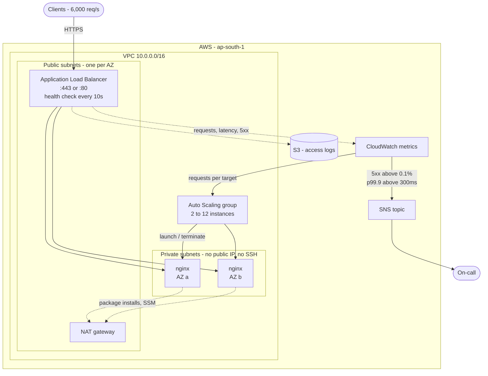
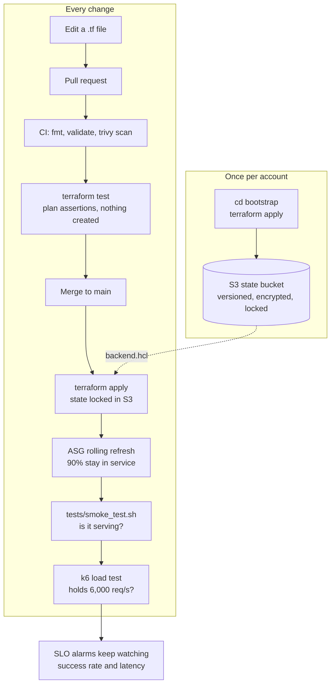

# Classroom Attendance Service - Infrastructure

Terraform for hosting the Classroom Attendance Service on AWS. The service
itself is the default nginx welcome page, as described in the brief.

The design goal is a boring, well understood stack: an Application Load Balancer
in front of an Auto Scaling group of nginx instances, with alarms that watch the
two SLOs directly.

## Architecture



The load balancer is the only thing with a public address. Everything else is
reachable only from it, or not at all.


| File | What it holds |
|------|---------------|
| `network.tf` | VPC, public/private subnets, internet and NAT gateways |
| `security.tf` | Security groups for the load balancer and the web tier |
| `iam.tf` | Instance role - SSM access instead of SSH keys |
| `compute.tf` | Launch template: Amazon Linux 2023 + nginx |
| `alb.tf` | Load balancer, target group, listeners |
| `access_logs.tf` | S3 bucket for load balancer access logs |
| `autoscaling.tf` | Auto Scaling group and the scaling policy |
| `observability.tf` | SLO alarms, alert topic, dashboard |
| `bootstrap/` | One-off stack that creates the S3 bucket holding Terraform state |

## How a change reaches production



Each step is cheaper than the one after it, so the fast checks fail first. The
plan tests cost nothing and need no infrastructure; the load test is the only
one that needs a running environment.

## Meeting 6,000 req/s

The scaling policy tracks **requests per instance**, not CPU. That is the metric
the requirement is written in, so the maths stays easy to follow:

- nginx serving one static page on a `c6i.large` handles far more than 1,000
  req/s. We budget **1,000 req/s per instance** anyway, which leaves room for a
  slow AZ, a noisy neighbour, or the page becoming a real application later.
- CloudWatch counts requests per minute, so 1,000 req/s is `60,000` -
  that is the default for `requests_per_target`.
- 6,000 req/s therefore settles at **6 instances**. `max_size = 12` gives
  12,000 req/s, double the requirement.
- `min_size = 2` keeps one instance in each AZ during quiet periods.

Scaling out takes roughly two to three minutes (alarm plus instance warm-up).
That is fine for organic growth. For a known spike - the start of a school day -
a scheduled scaling action is the right tool, and is listed under "next steps".

Losing an AZ removes half the fleet. The Auto Scaling group replaces those
instances in the surviving AZ, and the load balancer stops sending traffic to
the failed AZ within about 20 seconds. Running three AZs would soften that to a
third; it is a one-line change (`az_count = 3`).

## The SLOs

| SLO | Target | How we watch it |
|-----|--------|-----------------|
| Success rate | 99.9% | `slo-error-rate` alarm: 5xx responses over total requests, alerting above 0.1% |
| Latency | 99.9% under 300ms | `slo-latency` alarm: `TargetResponseTime` p99.9 above 0.3s |
| Capacity | no unhealthy targets | `unhealthy-hosts` alarm |

A 99.9% success rate is an error budget of about **43 minutes a month**. Both
SLO alarms need two consecutive one-minute breaches before they fire, which
keeps a single blip from waking someone up while still catching a real outage
inside a couple of minutes.

The `classroom-attendance-slo` dashboard shows requests per second, p99.9
latency against the 300ms line, 5xx counts, and healthy target count - the four
things worth looking at during an incident.

## Security

- **No SSH.** No key pairs, no port 22. Shell access is through SSM Session
  Manager, which is audited and needs no inbound rule.
- **No secrets in the repository.** There are none to store; AWS credentials
  come from SSO locally and from GitHub OIDC in CI. `*.tfvars` is gitignored.
- **Minimal attack surface.** Instances sit in private subnets with no public
  IP. The web security group only accepts traffic from the load balancer's
  security group, not from a CIDR range.
- **IMDSv2 required**, so an SSRF bug on the instance cannot be turned into
  stolen role credentials.
- **Encrypted EBS volumes** and `drop_invalid_header_fields` on the load
  balancer.
- **TLS is one variable away.** Set `certificate_arn` and the load balancer
  serves HTTPS on 443 with a TLS 1.2 floor, and port 80 becomes a 301 redirect.
  It ships off by default only because this exercise has no domain to certify.
- **Access logs** go to a private, encrypted bucket that rejects non-TLS
  requests, kept for 30 days.

## Testing

Three layers, cheapest first:

```bash
terraform fmt -check && terraform validate   # syntax and types
terraform test                               # plan-time assertions, no cost
./tests/smoke_test.sh                        # is it actually serving?
k6 run -e URL=http://<alb-dns> tests/load_test.js   # does it hold 6,000 req/s?
```

`tests/plan.tftest.hcl` asserts the properties that matter rather than the whole
plan: at least two AZs, ELB-based health checks, an internet-facing load
balancer, IMDSv2 required, enough maximum capacity, and that setting a
certificate really does switch port 80 to a redirect. The k6 thresholds are
the SLOs themselves, so a green load test is evidence, not an assumption.

`terraform fmt`, `validate` and a Trivy misconfiguration scan run in CI
(`.github/workflows/terraform.yml`). The scan is advisory today; it becomes a
merge gate once its findings are triaged.

## State

State lives in **S3**, with locking and encryption on:

```
s3://classroom-attendance-tfstate-<account-id>/attendance/terraform.tfstate
```

The bucket is created by the `bootstrap/` stack rather than by this one, because
a stack cannot store its own state in a bucket it has not created yet. That
stack keeps local state on purpose - it is four resources that are trivial to
recreate or import, and it changes about once a year.

The bucket has versioning (a bad apply can be rolled back), AES256 encryption
(state holds resource attributes in plaintext), public access fully blocked, a
policy rejecting non-TLS requests, and a lifecycle rule expiring old versions
after 90 days.

Locking uses S3's native `use_lockfile`, which writes a lock object beside the
state file. The DynamoDB lock table that older setups use is no longer needed.

The bucket name embeds the AWS account id, so it is **not** committed - it goes
in `backend.hcl`, which is gitignored. `backend.hcl.example` shows the format.

## Deploying

First time only, create the state bucket:

```bash
cd bootstrap && terraform init && terraform apply
```

Then point the root stack at it and deploy:

```bash
echo "bucket = \"$(cd bootstrap && terraform output -raw state_bucket)\"" > backend.hcl
terraform init -backend-config=backend.hcl
terraform plan
terraform apply
./tests/smoke_test.sh
```

Application changes roll out through the launch template. The Auto Scaling group
uses a rolling instance refresh that keeps 90% of the fleet in service, so a
deploy does not spend error budget.


## Deliberate production details

Small things that are easy to miss and expensive to learn the hard way:

- **Terraform does not manage `desired_capacity`.** If it did, any apply during
  a busy period would reset the fleet to `min_size` and drop traffic on the
  floor. Scaling owns it at runtime; `ignore_changes` keeps the two from
  fighting.
- **The Auto Scaling group waits for the NAT route.** Without that dependency
  the first instances can launch before they have egress, fail to install nginx,
  and get replaced - a slow, confusing first apply.
- **A 180 second health check grace period**, long enough to boot and install
  before the first failed check counts.
- **`prevent_destroy` on the state bucket**, because deleting it would orphan
  every resource in the stack.
- **Rolling instance refresh at 90% healthy**, so a deploy cannot spend the
  error budget it is supposed to protect.

## Trade-offs I made deliberately

- **One NAT gateway, not one per AZ.** It costs less and is not in the request
  path - it only carries package installs and SSM traffic. If an instance ever
  needs egress to serve a request, this becomes a per-AZ resource.
- **HTTP by default, HTTPS supported.** The 443 listener and the redirect are
  written and tested; they switch on with `certificate_arn`. The exercise gives
  no domain to issue a certificate for, so the default stays HTTP.
- **Flat file layout, no modules.** One environment, one stack. Modules earn
  their keep when a second environment appears; before that they add indirection
  without removing duplication.
- **The state bucket is a separate stack with local state.** Someone has to go
  first, and a bucket that changes yearly does not belong in the stack that
  changes daily.

## Next steps

Given more than the suggested two to three hours, in priority order:

1. A golden AMI built with Packer. Today each instance installs nginx at boot,
   so a package mirror outage delays scale-out exactly when it is needed most.
2. Scheduled scaling ahead of known daily peaks, since reactive scaling takes
   two to three minutes.
3. AWS WAF in front of the load balancer for rate limiting and common exploits.
4. VPC flow logs, and shipping access logs into Athena for querying.
5. A third AZ, and per-AZ NAT gateways if egress becomes request critical.
