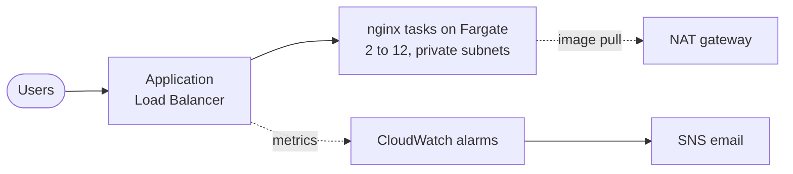

# Classroom Attendance Service

Terraform for a small web service on AWS. It runs the default nginx page on ECS
Fargate behind an Application Load Balancer, scales on traffic, and alarms on
the two SLOs.

Region is `ap-south-1`. Everything is in one Terraform configuration.

## Architecture



- The load balancer sits in public subnets and is the only thing with a public
  address.
- Tasks run in private subnets with no public IP. Their security group only
  accepts traffic from the load balancer's security group.
- Two Availability Zones, so one can fail without taking the service down.

## Files

| File | Contents |
|------|----------|
| `network.tf` | VPC, subnets, internet gateway, NAT gateway, routes |
| `alb.tf` | Security groups, load balancer, target group, listener |
| `ecs.tf` | Cluster, task definition, service, autoscaling |
| `alarms.tf` | SNS topic and the three alarms |
| `variables.tf`, `outputs.tf`, `versions.tf` | Inputs, outputs, provider and backend |

## Running it

```bash
terraform init
terraform plan
terraform apply
./tests/smoke_test.sh
```

State is kept in S3 (`classroom-attendance-infra-tfstate`) with encryption and
locking, so it is not on one laptop and two people cannot apply at once. The
bucket was created outside this configuration, because a stack cannot store its
state in a bucket it has not created yet.

To send yourself alarms, set `alert_email` and confirm the subscription email.

## Handling 6,000 req/s

Scaling tracks requests per task instead of CPU, since requests are what the
requirement is written in.

- One task gets 1 vCPU. nginx serving a static page handles well over 1,000
  req/s on that, but I budget 1,000 to leave room.
- CloudWatch counts per minute, so 1,000 req/s is 60,000. That is the default
  for `requests_per_target`.
- 6,000 req/s therefore lands at 6 tasks. The maximum of 12 gives 12,000 req/s.
- The minimum of 2 keeps one task in each AZ when it is quiet.

A new task takes about 30 to 60 seconds to start and pull the image. Scale out
uses a 30 second cooldown and scale in 180, because being briefly over
provisioned is cheaper than being short.

## SLOs and alarms

Two SLOs: 99.9% of requests succeed, and 99.9% are served in under 300ms.

| Alarm | Why |
|-------|-----|
| 5xx rate over 0.1% | Rate rather than a count, so a quiet hour with three errors does not page anyone |
| p99 response time over 300ms | An average would hide the slow tail the SLO is about |
| Fewer than 2 healthy tasks | Capacity warning: one AZ failure away from an outage |

All three publish to one SNS topic.

## Security

- No SSH, no key pairs, no EC2 instances. There is no host of ours to patch.
- Tasks are private and only reachable from the load balancer.
- The image is pinned to `nginx:1.27-alpine` rather than `latest`, so scaling
  out cannot quietly change what is running.
- The task has no IAM role, since nginx does not call AWS. Only the execution
  role exists, and it just pulls the image and writes logs.

## Testing

```bash
terraform fmt -check
terraform validate
terraform test              # plan assertions, creates nothing
./tests/smoke_test.sh       # HTTP 200 and the nginx page
k6 run -e URL=http://<alb-dns> tests/load_test.js
```

`terraform test` checks two AZs, a minimum of two tasks, no public IPs on tasks,
and that the maximum capacity clears 6,000 req/s. `fmt`, `init` and `validate`
also run in GitHub Actions on every push.

## Choices I made

- **Fargate, not EC2.** EC2 is cheaper per vCPU at steady load, but it means an
  AMI to patch and packages installed at boot. For one nginx page, Fargate is
  less to run.
- **One NAT gateway, not one per AZ.** It only carries image pulls, not user
  traffic. If a task ever needed egress to serve a request, this would change.
- **Terraform does not manage `desired_count`.** Autoscaling owns it once the
  service is up. Otherwise a later apply would reset the task count to the
  minimum, possibly during a busy period.
- **HTTP, not HTTPS.** TLS needs a domain and a certificate, which this exercise
  does not have. Adding a 443 listener and redirecting 80 is a small change.

## What I would add next

1. TLS at the load balancer, with ACM and Route 53.
2. ALB access logs to S3, for the per-request questions metrics cannot answer.
3. A CloudWatch dashboard, so there is something to look at during an incident.
4. Scheduled scaling before known daily peaks, like the start of a school day.
5. A third AZ if the service becomes more important than this one.
