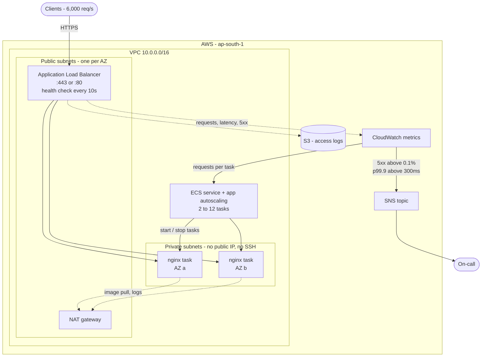
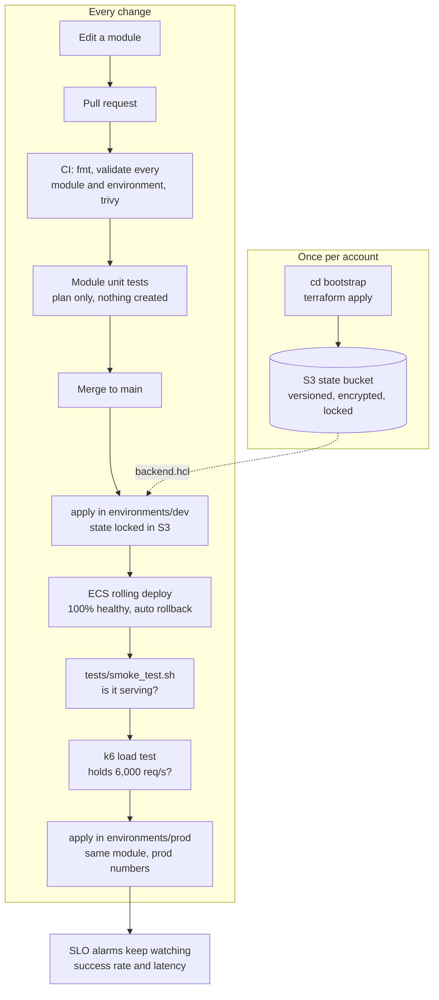

# Classroom Attendance Service - Infrastructure

Terraform for hosting the Classroom Attendance Service on AWS. The service
itself is the default nginx welcome page, as described in the brief.

The design goal is a boring, well understood stack: an Application Load Balancer
in front of nginx running on ECS Fargate, with alarms that watch the two SLOs
directly. There are no servers to patch and nothing is installed at boot - the
image is pinned and pulled.

## Architecture



The load balancer is the only thing with a public address. Everything else is
reachable only from it, or not at all.


### Repository layout

```
modules/
  network/         VPC, subnets, NAT, routes
  service/         security groups, ALB, ECS cluster/task/service, scaling, access logs
  observability/   SLO alarms, alert topic, dashboard
environments/
  dev/             calls the three modules with dev numbers
  prod/            calls the same three modules with prod numbers
bootstrap/         one-off stack that creates the S3 state bucket
tests/             smoke test and k6 load test
```

The modules are split where the **lifecycle and ownership** differ, not per
resource type. The network changes about once a year, the service changes
weekly, and the alarms are the part another service would reuse first. A module
per resource - a "VPC module" wrapping a VPC - would be indirection with no
reuse behind it.

`environments/dev` and `environments/prod` are the two callers that make the
split worth having. Each is a short file of literal values, so reading one tells
you exactly what that environment is:

| | dev | prod |
|---|---|---|
| AZs | 2 | 3 |
| Tasks | 2 to 12 | 6 to 24 |
| Deletion protection | off | on |
| Log retention | 30 days | 90 days |

Each environment keeps its own state file (`attendance/dev/…`,
`attendance/prod/…`) in the same bucket, so an apply against dev can never touch
prod.

## How a change reaches production



Each step is cheaper than the one after it, so the fast checks fail first. The
module tests cost nothing and need no infrastructure; the load test is the only
one that needs a running environment. Prod runs the same module code that dev
just proved, with different numbers.

## Meeting 6,000 req/s

The scaling policy tracks **requests per task**, not CPU. That is the metric the
requirement is written in, so the maths stays easy to follow:

- nginx serving one static page on 1 vCPU handles far more than 1,000 req/s. We
  budget **1,000 req/s per task** anyway, which leaves room for a slow AZ, a
  noisy neighbour, or the page becoming a real application later.
- CloudWatch counts requests per minute, so 1,000 req/s is `60,000` - that is
  the default for `requests_per_target`.
- 6,000 req/s therefore settles at **6 tasks**. `max_tasks = 12` gives
  12,000 req/s, double the requirement.
- `min_tasks = 2` keeps one task in each AZ during quiet periods.

Scaling out takes roughly 30 to 60 seconds: a task starts and pulls a small
image, with no operating system to boot and no packages to install. That is
about three times faster than the EC2 equivalent, which matters because a slow
scale-out is spent directly out of the error budget.

Losing an AZ removes half the tasks. ECS starts replacements in the surviving
AZ, and the load balancer stops sending traffic to the failed AZ within about
20 seconds. Running three AZs would soften that to a third; it is a one-line
change (`az_count = 3`).

## The SLOs

| SLO | Target | How we watch it |
|-----|--------|-----------------|
| Success rate | 99.9% | `slo-error-rate` alarm: 5xx responses over total requests, alerting above 0.1% |
| Latency | 99.9% under 300ms | `slo-latency` alarm: `TargetResponseTime` p99.9 above 0.3s |
| Capacity | no unhealthy targets | `unhealthy-hosts` alarm |

A 99.9% success rate is an error budget of about **43 minutes a month**. Both
SLO alarms need two consecutive one-minute breaches before they fire, which
keeps a single blip from waking someone up while still catching a real outage
inside a couple of minutes.

The `classroom-attendance-slo` dashboard shows requests per second, p99.9
latency against the 300ms line, 5xx counts, and healthy target count - the four
things worth looking at during an incident.

## Security

- **No hosts at all.** Fargate means there is no operating system of ours to
  patch, no SSH, no key pairs and no port 22. A debug shell goes through ECS
  Exec, which is audited and needs no inbound rule.
- **No secrets in the repository.** There are none to store; AWS credentials
  come from SSO locally and from GitHub OIDC in CI. `*.tfvars` is gitignored.
- **Minimal attack surface.** Tasks sit in private subnets with no public IP.
  The task security group only accepts traffic from the load balancer's security
  group, not from a CIDR range.
- **A pinned image.** `nginx:1.27-alpine`, not `:latest`, so a scale-out event
  cannot quietly change what is running.
- **Split roles.** The execution role pulls the image and writes logs; the task
  role is what the container itself can do, which here is nothing but ECS Exec.
- **`drop_invalid_header_fields`** on the load balancer.
- **TLS is one variable away.** Set `certificate_arn` and the load balancer
  serves HTTPS on 443 with a TLS 1.2 floor, and port 80 becomes a 301 redirect.
  It ships off by default only because this exercise has no domain to certify.
- **Access logs** go to a private, encrypted bucket that rejects non-TLS
  requests, kept for 30 days.

## Testing

Three layers, cheapest first:

```bash
terraform fmt -check -recursive              # formatting
terraform -chdir=modules/network test        # module unit tests, no cost
terraform -chdir=modules/service test
./tests/smoke_test.sh http://<alb-dns>       # is it actually serving?
k6 run -e URL=http://<alb-dns> tests/load_test.js   # does it hold 6,000 req/s?
```

The module tests are real unit tests: the service module is planned with
placeholder subnet ids, so it needs no VPC and creates nothing. They assert the
properties that matter rather than the whole plan - tasks get no public IP,
targets register by IP, a deploy never drops below 100% healthy, a failed deploy
rolls back, capacity can exceed 6,000 req/s, and setting a certificate really
does switch port 80 to a redirect. The k6 thresholds are
the SLOs themselves, so a green load test is evidence, not an assumption.

CI (`.github/workflows/terraform.yml`) formats, then initialises and validates
**every module and every environment** in turn, then runs a Trivy
misconfiguration scan. The scan is advisory today; it becomes a merge gate once
its findings are triaged.

## State

State lives in **S3**, with locking and encryption on:

```
s3://classroom-attendance-tfstate-<account-id>/attendance/terraform.tfstate
```

One state file per environment, so an apply against dev cannot touch prod. The
bucket is created by the `bootstrap/` stack rather than by an environment,
because a stack cannot store its own state in a bucket it has not created yet. That
stack keeps local state on purpose - it is four resources that are trivial to
recreate or import, and it changes about once a year.

The bucket has versioning (a bad apply can be rolled back), AES256 encryption
(state holds resource attributes in plaintext), public access fully blocked, a
policy rejecting non-TLS requests, and a lifecycle rule expiring old versions
after 90 days.

Locking uses S3's native `use_lockfile`, which writes a lock object beside the
state file. The DynamoDB lock table that older setups use is no longer needed.

The bucket name embeds the AWS account id, so it is **not** committed - it goes
in `backend.hcl`, which is gitignored. `backend.hcl.example` shows the format.

## Deploying

First time only, create the state bucket:

```bash
cd bootstrap && terraform init && terraform apply
```

Then deploy an environment. Every command runs from that environment's
directory, which is what stops an apply meant for dev reaching prod:

```bash
cd environments/dev
cp backend.hcl.example backend.hcl     # fill in the bucket name
terraform init -backend-config=backend.hcl
terraform plan
terraform apply
../../tests/smoke_test.sh
```

Promoting a change to prod is the same commands in `environments/prod`, against
the same module code.

Application changes roll out through the task definition. ECS starts the new
tasks before draining the old ones, and the deployment circuit breaker rolls
back automatically if the new ones cannot pass health checks - so a deploy does
not spend error budget.


## Deliberate production details

Small things that are easy to miss and expensive to learn the hard way:

- **Terraform does not manage `desired_count`.** If it did, any apply during a
  busy period would reset the service to `min_tasks` and drop traffic on the
  floor. Scaling owns it at runtime; `ignore_changes` keeps the two from
  fighting.
- **The service waits for the NAT route.** Without that dependency the first
  tasks can start before they have egress, fail to pull the image, and sit in a
  retry loop - a slow, confusing first apply.
- **A deployment circuit breaker with rollback**, so a bad task definition
  reverts itself instead of sitting there half deployed.
- **100% minimum healthy during deploys**: new tasks start before old ones
  drain, so a deploy cannot spend the error budget it is meant to protect.
- **Asymmetric cooldowns.** Scale out after 30 seconds, scale in after 180.
  Being briefly over-provisioned is cheap; being under-provisioned is not.
- **`prevent_destroy` on the state bucket**, because deleting it would orphan
  every resource in the stack.

## Trade-offs I made deliberately

- **Fargate rather than EC2.** EC2 with Spot or Savings Plans is cheaper per
  vCPU at steady load, and gives more control over kernel tuning. Fargate wins
  here because the operational surface is smaller: no AMI pipeline, no patching,
  no packages installed at boot, and scale-out in under a minute. For a service
  this simple, the premium buys back real work.
- **One NAT gateway, not one per AZ.** It costs less and is not in the request
  path - it only carries image pulls and log traffic. If a task ever needs
  egress to serve a request, this becomes a per-AZ resource.
- **HTTP by default, HTTPS supported.** The 443 listener and the redirect are
  written and tested; they switch on with `certificate_arn`. The exercise gives
  no domain to issue a certificate for, so the default stays HTTP.
- **Three modules, not one per resource.** The split follows lifecycle and
  ownership, and exists because there are two callers. A single module per
  resource type would add a layer to read through without removing any
  duplication.
- **The state bucket is a separate stack with local state.** Someone has to go
  first, and a bucket that changes yearly does not belong in the stack that
  changes daily.

## Next steps

Given more than the suggested two to three hours, in priority order:

1. Mirror the image into ECR. Pulling `nginx` from Docker Hub works, but public
   registries rate limit, and a scale-out event is the worst time to discover
   that.
2. VPC endpoints for ECR, CloudWatch Logs and S3, so image pulls never leave the
   VPC and the NAT gateway stops being a dependency at all.
3. Scheduled scaling ahead of known daily peaks, since even fast reactive
   scaling trails a step change in traffic.
4. AWS WAF in front of the load balancer for rate limiting and common exploits.
5. FARGATE_SPOT for a portion of the fleet, once the service tolerates task
   interruption.
